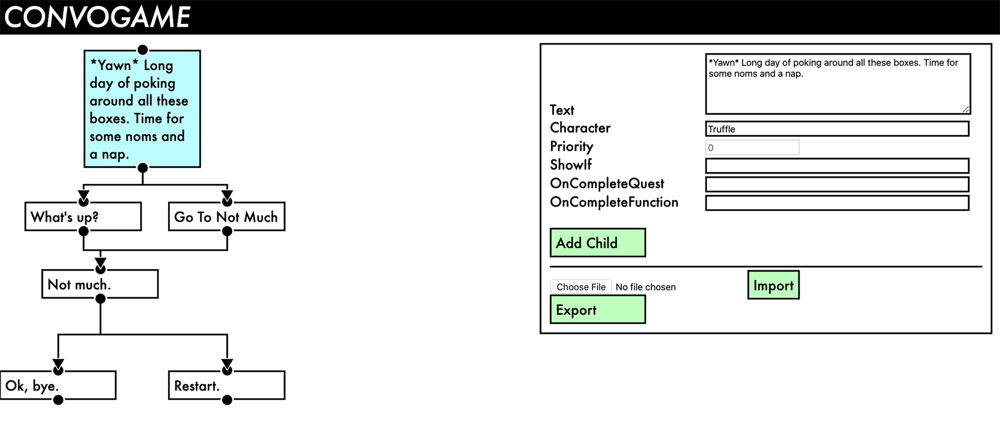

# ConvoGame
A tool for game developers to create dialogue trees in a non-complicated manor. This tool allows developers to build conversations graphically, then export them as .json files that can be used in the game engine of your choice.

[Live Demo](https://abbieschenk.com/convogame/)

This project was created for development on [Catlandia](http://catlandiagame.com/), and was used to rapidly prototype conversations for use with Unity3D. Catlandia has been released on [Steam](https://store.steampowered.com/app/1219700/Catlandia_Crisis_at_Fort_Pawprint/?snr=1_5_1100__1100), the [iOS App Store](https://apps.apple.com/us/app/catlandia/id1498721123?ls=1), and [Google Play](https://play.google.com/store/apps/details?id=com.PolarTabby.CatlandiaPawprint&pcampaignid=pcampaignidMKT-Other-global-all-co-prtnr-py-PartBadge-Mar2515-1).

This project is heavily inspired by my work on [ScriptEase II](https://webdocs.cs.ualberta.ca/~script/), a game-independent GUI script generator built as part of the BELIEVE research group at the University of Alberta.

## No Longer Maintained
This repository is **no longer maintained** as development on Catlandia has wrapped up. I'm also working on a more generic, better coded tree editor with save functionality, and that should absolutely fix the below issue. I will link to the new project here when it is live.

## Known Issues - Use At Your Own Risk
The only two known major issue are that **looped conversations break on export,** and that there is **no accessibility support**. Exporting a dialogue with parent-less nodes aside from the original root node will also not export those parent-less nodes.

The only known minor issue is that the root node can turn red as a warning that it doesn't have a parent node — this shouldn't affect functionality. However, there may be other issues that are not documented as this was rapidly developed while in use by game developers. Use at your own risk!